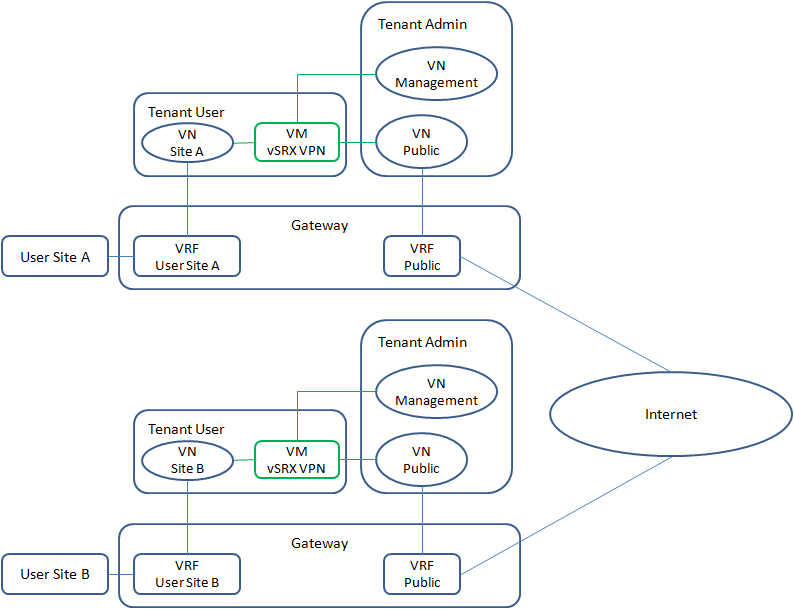
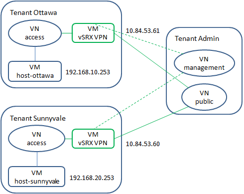

# Goal
Demonstrate the capability of VPNaaS (VPN as a Service) by the integration of OpenContrail and OpenStack.
# 1. Introduction
OpenStack is an implemention of computing virtualization and OpenContrail is an implementation of networking virtualization. Service virtualization is supported by the integration of OpenContrail and OpenStack. In this demo, a command line utility is implemented as the front-end of VPNaaS. The back-end of VPNaaS is implemented by [vSRX](vsrx-service.md).

Here is an example of use case.


The IPSec connection going through internet is created by vSRX service in two cloulds. All traffic between site A and site B virtual networks in two cloulds is private and secured.
# 2. Command Line Utility
```
vpnaas [access options] <command> <object> [name] [options]
  access options:
    Options to access API server of OpenStack and OpenContrail.
    --username <user name>
    --password <user password>
    --region <region name>
    --tenant <tenant name>
    --api-server <API server IP address>

  <command> <object> [name] [options]:
    add service
      Create and initialize service.

    show service
      Show service.

    delete service
      Delete service.

    add ike-policy <name>
      Add IKE policy.
      --auth-algorithm [ sha1 | sha-256 | sha-384 | md5 ]
      --encryption-algorithm [ 3des-cbc | aes-128-cbc | aes-192-cbc |
                               aes-256-cbc | des-cbc ]
      --phase1-mode [ aggressive | main ]

    show ike-policy <name>
        Show IKE policy.

    delete ike-policy <name>
        Delete IKE policy.

    add ipsec-policy <name>
      Add IPSec policy.
      --auth-algorithm [ hmac-md5-96 | hmac-sha-256-128 | hmac-sha1-96 ]
      --encryption-algorithm [ 3des-cbc | aes-128-cbc | aes-192-cbc |
                               aes-256-cbc | des-cbc ]

    show ipsec-policy <name>
      Show IPSec Policy.

    delete ipsec-policy <name>
      Delete IPSec policy.

    add connection <name>
      Add IPSec connection.
      --ike-policy <IKE policy>
      --ipsec-policy <IPSec policy>
      --dst-subnet <destination subnet>
      --peer-address <peer address>

    show connection <name>
      Show IPSec connection.

    delete connection <name>
      Delete IPSec connection.
```
# 3. Demo
## 3.1 Overview

* To simplify the demo, a IPSec connection is created between virtual networks of two tenants within one cloud.
* A virtual machine is created on virtual network "access" in each tenant.

## 3.2 Preparations
Based on a fresh installation of Juniper OpenStack Distribution, some configurations need to be done to prepare the demo. Some utilities are required from this repository.
https://github.com/tonyliu0592/orch
* As described in 1.3.3 in [vSRX as a Service](vsrx-service.md), nova needs to be updated on all compute nodes.
* Get code from GitHub.
```
# git clone https://github.com/tonyliu0592/orch.git
# cd orch
# git clone https://github.com/leopoul/ncclient.git
# mv ncclinet ncclient.orig
# mv ncclient.orig/ncclient ./
# rm -fr ncclient.orig
```
Update script `config` with proper access settings.
* VN "management" and "public" with public address in administration tenant
```
# config --tenant admin add ipam ipam-default
# config --tenant admin add network management --ipam ipam-default --subnet 10.84.53.128/28 --route-target 64512:10284
# config --tenant admin add network public --ipam ipam-default --subnet 10.84.53.48/28 --route-target 64512:10184
```
* Service template
```
# config --tenant admin add service-template vsrx-vpn --mode in-network --type firewall --image "vSRX 12.1X46-D20.5" --flavor m1.medium --interface-type management --interface-type left --interface-type right
```
* Tenant "ottawa" and "sunnyvale"
Update `/etc/contrail/openstackrc` with proper access settings.
```
# source /etc/contrail/openstackrc
# keystone tenant-create --name ottawa --enabled true
# keystone tenant-create --name sunnyvale --enabled true
# keystone help user-role-add
# keystone user-role-add --user admin --role admin --tenant ottawa
# keystone user-role-add --user admin --role admin --tenant sunnyvale
```
* Virtual network "access" in tenant "ottawa" and "sunnyvale"
```
# config --tenant ottawa add ipam ipam-default
# config --tenant ottawa add ipam ipam-default
# config --tenant ottawa add network access --ipam ipam-default --subnet 192.168.10.0/24
# config --tenant sunnyvale add ipam ipam-default
# config --tenant sunnyvale add ipam ipam-default             
# config --tenant sunnyvale add network access --ipam ipam-default --subnet 192.168.20.0/24
```
* Virtual machine "host-ottawa" and "host-sunnyvale"
```
# config --tenant ottawa add vm host-ottawa --image "CentOS 6.4 1-6" --flavor m1.small --network access
# config --tenant sunnyvale add vm host-sunnyvale --image "CentOS 6.4 1-6" --flavor m1.small --network access
```
## 3.3 Launch and provisioning service
Once the cloud is prepared, run utility `vpnaas` to do the followings.
```
# vpnaas --tenant ottawa add ike-policy ike-phase1 --auth-algorithm sha1 --encryption-algorithm aes-128-cbc --phase1-mode main
# vpnaas --tenant ottawa add ipsec-policy ipsec-phase2 --auth-algorithm hmac-sha1-96 --encryption-algorithm aes-128-cbc
# vpnaas --tenant ottawa add connection sunnyvale --dst-subnet 192.168.20.0/24 --peer-address 10.84.53.60 --ike-policy ike-phase1 --ipsec-policy ipsec-phase2
# vpnaas --tenant sunnyvale add ike-policy ike-phase1 --auth-algorithm sha1 --encryption-algorithm aes-128-cbc --phase1-mode main
# vpnaas --tenant sunnyvale add ipsec-policy ipsec-phase2 --auth-algorithm hmac-sha1-96 --encryption-algorithm aes-128-cbc
# vpnaas --tenant sunnyvale add connection ottawa --dst-subnet 192.168.10.0/24 --peer-address 10.84.53.61 --ike-policy ike-phase1 --ipsec-policy ipsec-phase2
```
Now, an IPSec tunnel is created. Virtual machine "host-ottawa" is able to communicate with "host-sunnyvale" through IPSec tunnel.


